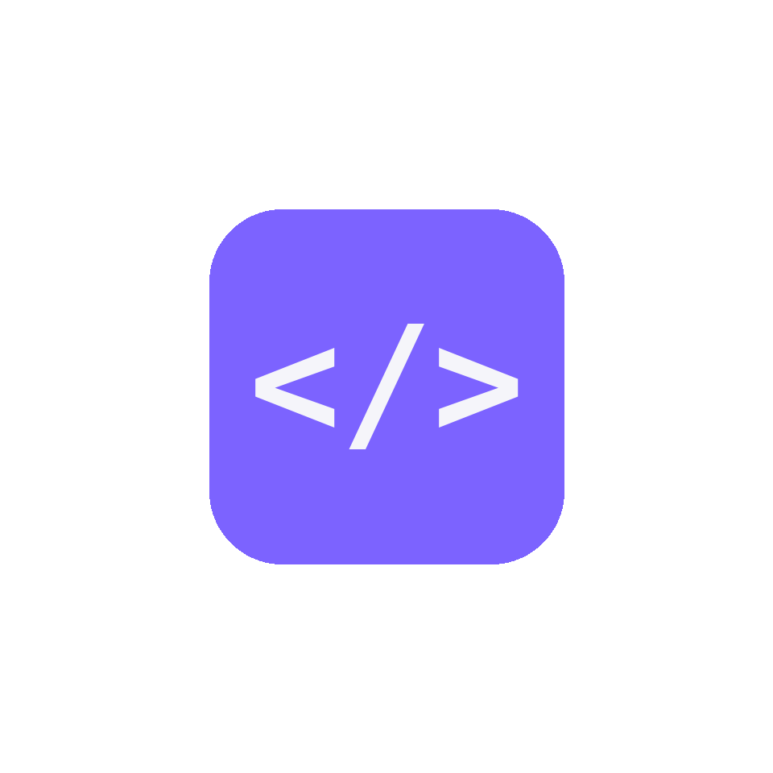
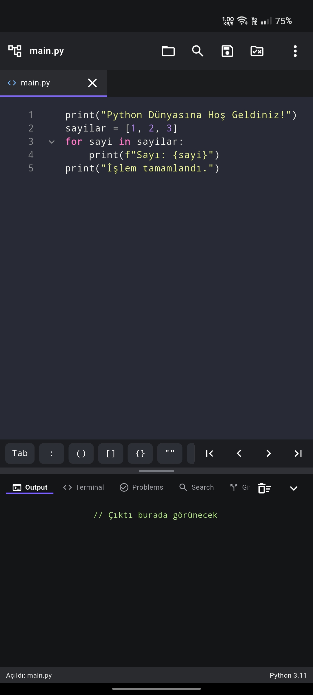
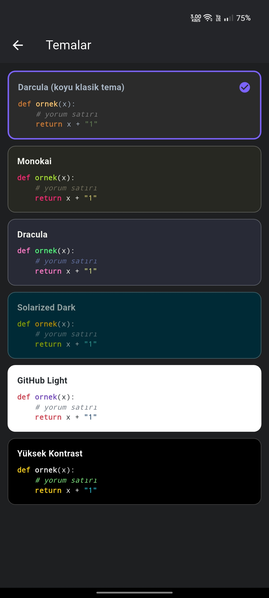
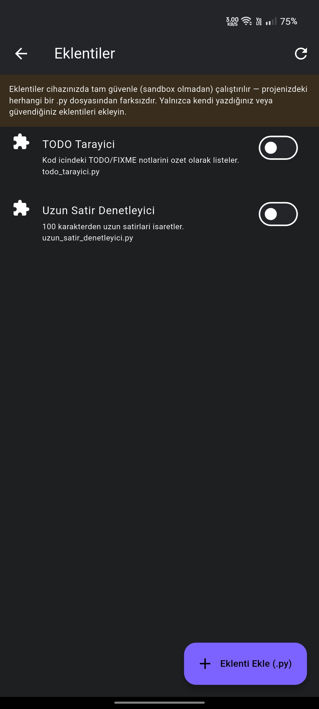

<p align="center">
  
</p>

<h1 align="center">PySpace</h1>

<p align="center">
  Mobilde Python geliştirmek için native bir Android IDE'si.<br/>
  Kişisel bir hobi projesi olarak geliştiriliyor.
</p>

---

## Nedir?

**PySpace**, telefonundan/tabletinden Python projeleri üzerinde çalışmanı
sağlayan, masaüstü bir IDE'nin temel özelliklerini mobile taşımayı
hedefleyen bir Flutter uygulamasıdır. Kod yazma, çalıştırma, hata ayıklama,
akıllı kod tamamlama ve proje yönetimini tek bir uygulama içinde bir araya
getirir.

## Özellikler

- **Kod editörü** — sözdizimi vurgulamalı, sekmeli (çoklu dosya) düzenleme;
  bölünmüş ekran (split view) desteği
- **Tema desteği** — Darcula, Monokai, GitHub Light ve daha fazlası arasında
  anında geçiş
- **Akıllı kod tamamlama** — [Jedi](https://github.com/davidhalter/jedi)
  tabanlı; git-to-definition, yeniden adlandırma (rename), değişken/fonksiyon
  çıkarma (extract), hızlı düzeltmeler (quick fix)
- **AST tabanlı analiz** — "Problems" panelinde anlık hata/uyarı listesi
- **Hata ayıklayıcı (debugger)** — breakpoint, step over/into/out, değişken
  ve call stack izleme
- **Çalıştırma yapılandırmaları (Run configs)** — birden fazla giriş
  noktasını farklı argümanlarla tanımlama
- **Yerleşik terminal**
- **Test çalıştırıcı** — pytest entegrasyonu
- **Git entegrasyonu** — durum görüntüleme ve temel işlemler
- **Eklenti sistemi** — kendi Python dosyalarını eklenti olarak yükleme
- **Proje geneli arama**
- **Klavye kısayolları** — harici klavye desteğiyle tamamen özelleştirilebilir
- **Çoklu proje desteği** — projeler arasında hızlı geçiş
- **Docstring üretici**

## Ekran Görüntüleri

<table align="center">
  <tr>
    <td align="center">
      <br/>
      <sub></sub>
    </td>
    <td align="center">
      <br/>
      <sub></sub>
    </td>
    <td align="center">
      <br/>
      <sub></sub>
    </td>
  </tr>
</table>

## Teknoloji

| Katman              | Teknoloji                                             |
| ------------------- | ------------------------------------------------------ |
| Arayüz               | Flutter / Dart                                         |
| Python çalışma zamanı | [Chaquopy](https://chaquo.com/chaquopy/) (Android üzerinde gömülü Python 3.11) |
| Kod zekası            | [Jedi](https://github.com/davidhalter/jedi)             |
| Native köprü          | Kotlin (`MethodChannel`)                                |

## Desteklenen Platform

Şu an yalnızca **Android**. Python çalıştırma altyapısı olarak kullanılan
Chaquopy Android'e özgü olduğu için iOS desteği bulunmuyor.

## Bilinen Sınırlamalar

- Eklentiler herhangi bir sandbox olmadan, tam cihaz izniyle çalışır —
  yalnızca güvendiğin `.py` dosyalarını eklenti olarak yükle.
- **iOS desteği yok** (bkz. yukarıdaki "Desteklenen Platform").

## Lisans

Bu proje halen aktif geliştirme aşamasındadır ve henüz kararlı bir sürüme
ulaşmamıştır. Bu nedenle şimdilik **açık kaynak bir lisans altında
yayınlanmamaktadır** — tüm hakları saklıdır.

```
Copyright (c) 2026 Esvi (github.com/esvius)
Tüm hakları saklıdır.

Bu depodaki kaynak kod yalnızca inceleme amacıyla herkese açıktır.
Yazarın açık izni olmadan kopyalanamaz, değiştirilemez, dağıtılamaz
veya ticari/ticari olmayan herhangi bir amaçla kullanılamaz.
```

Proje kararlı bir sürüme ulaştığında uygun bir açık kaynak lisansı
(ör. MIT) eklenmesi planlanıyor.

## İletişim

GitHub: [github.com/esvius](https://github.com/esvius)
